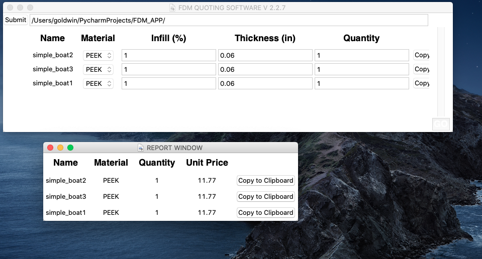

# FDM part quoting application

This is a revised version of the first major python programming project. Because I was learning a lot of the code here
could use improving. I've done some work on improving it and getting it to a point where it all works
together, but much more work is needed to get it to a point where it is trustworthy

When it's all running, it looks something like this:

## How to use ##
1. setup an invironment and run Main.py
2. enter in a path to a folder with .stl files you wish to price
3. press submit
4. pick what parameters you would like for each part
5. get a report by pressing "GO"

## Linux/Mac Environment Setup ##
- Get virtualenv with: <code>pip3 install virtualenv</code> This should add virtualenv to the system. 
- To create a virtual env, now use <code>python3 -m venv env_name</code> this will create a virtual env in a folder by that name
- Activate the env by using <code>source env_name/bin/activate</code> 
- To use a requirements file type <code>pip install -r step1/requirements.txt</code> 

## Issues ##
- Prices not being properly calculated
- mesh values being recalculated several times slows down report generation
- UI not properly constrained and parts are out of bounds 
